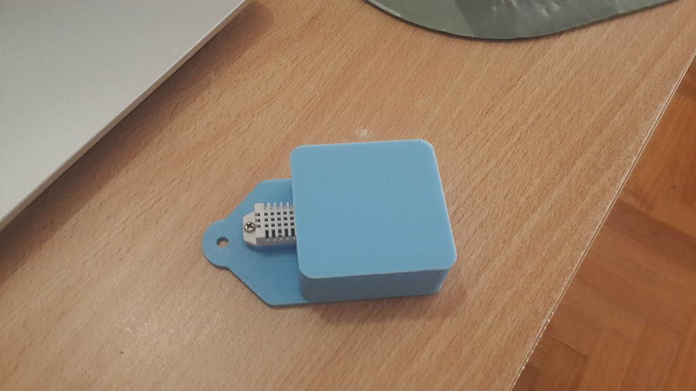

# Weather Station
Collecting temperature and humidity from ESP8266 into a MongoDB database and viewing data with charts.

* `api`: WebServer RESTful API with NodeJS
* `arduino`: Arduino code for ESP8266 (for uploading code follow [these instructions](https://github.com/pjnovas/weather-station/blob/master/electronics/README.md#uploading-code) )
* `web`: WebClient for viewing states stored
* `electronics`: Schema, components and modules list
* `box`: 3D design of the clousure and STL files for 3D Printing

