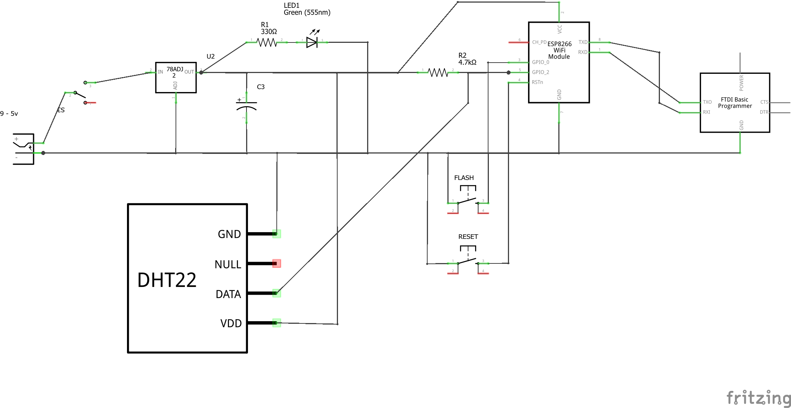
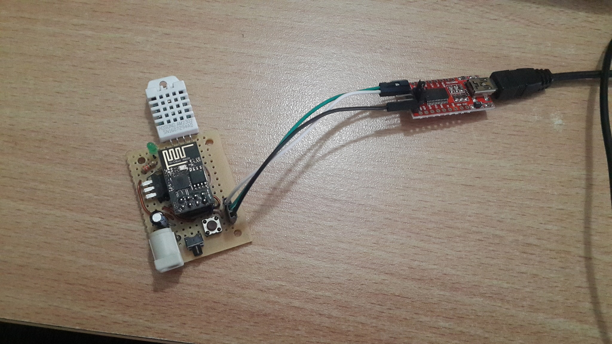

## Components
* Power plug
* Capacitor Polarized	100uf 25v
* 2x	Momentary Switch (reset and flash buttons)
* Green LED 3 mm 
* 330Ω Resistor
* 4.7kΩ Resistor
* Voltage Regulator 3.3V LD1117

## Modules
* ESP8266 WiFi ESP-01
* DHT22 Humidity and Temperature Sensor	
* FTDI Basic Programmer (FT232RL)

## Uploading code
1. Press and hold Flash Button
2. Press once Reset button (keep holding flash)
3. Click Upload on Arduino IDE
4. After compiling and when starts uploading release Flash Button

